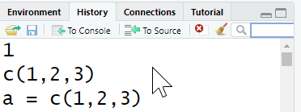

# RHistory

similar to unix history command, you can see previously entered commands using following function

	history() 

History panel in RStudio shows same information.

You can save your history
savehistory(file="myfile") # default is ".Rhistory"

you can also load it again

loadhistory(file="myfile") # default is ".Rhistory"

